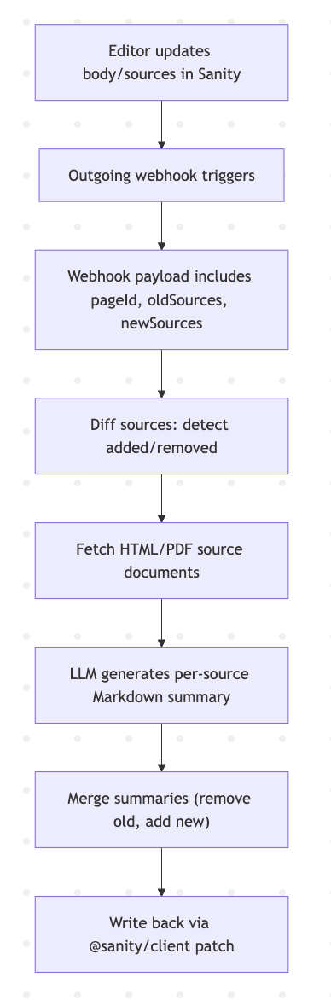

# DragonGC Screening – Ezequiel Dufau

Hi DragonGC team,  

Thanks for the opportunity. Below are my responses:  

---

## 1. Self-Reflection & Growth  

A piece of feedback I received was: *“When you explain technical concepts, you go too deep too quickly, and it’s hard for others—especially juniors or non-engineers—to follow.”*  

At first, I resisted this feedback because I saw myself as someone who added value by sharing knowledge in detail. I thought I was being thorough, not overwhelming. It felt unfair because my intention was always to help.  

Over time, I started noticing subtle signals: in meetings, teammates stopped asking follow-up questions; in code reviews, juniors would accept suggestions without much discussion. I realized that instead of empowering others, my explanations were sometimes shutting down curiosity. To test this, I asked a colleague to give me notes after one of my walkthroughs. They confirmed that the depth was useful, but the pacing and level of abstraction weren’t well-matched to the audience.  

That realization changed my approach. I began to:  
- Adjust explanations depending on the audience (focusing on “why” and trade-offs before diving into implementation details).  
- Use analogies and simpler examples to connect new concepts to familiar ground.  
- End explanations with quick check-ins (“does this make sense so far?”).  

In the long term, this shifted how I see mentoring: it’s not just about transferring knowledge, but about making others confident enough to use it. Now I measure success not by how much detail I can share, but by whether the other person walks away clearer and more capable.  

---

## 2. Real-World Problem Solving: LLM Summaries from Linked Sources  

### Markdown Format  

```markdown
# Topic: [Page Title]

## Editorial Summary
[Editor-written body text]

---

## Source Summaries

### [Source Title or ID]
- **Type:** Statute | Filing | Memo  
- **Link:** [URL or reference]  
- **Summary:**  
  [LLM-generated summary]

---

### [Source Title or ID]
- **Type:** …  
- **Link:** …  
- **Summary:**  
  …


flowchart TD
  A[Editor updates body/sources in Sanity] --> B[Outgoing webhook triggers]
  B --> C[Webhook payload includes pageId, oldSources, newSources]
  C --> D[Diff sources: detect added/removed]
  D --> E[Fetch HTML/PDF source documents]
  E --> F[LLM generates per-source Markdown summary]
  F --> G[Merge summaries (remove old, add new)]
  G --> H[Write back via @sanity/client patch]

```

## Diagram
```markdown
flowchart TD
  A[Editor updates body/sources in Sanity] --> B[Outgoing webhook triggers]
  B --> C[Webhook payload includes pageId, oldSources, newSources]
  C --> D[Diff sources: detect added/removed]
  D --> E[Fetch HTML/PDF source documents]
  E --> F[LLM generates per-source Markdown summary]
  F --> G[Merge summaries (remove old, add new)]
  G --> H[Write back via @sanity/client patch]
```




## Implementation Flow

### Clarifying Notes

- **Webhook trigger:** Sanity does not execute functions directly. When you configure an Outgoing Webhook in sanity.io/manage, Sanity sends an HTTP POST to the endpoint you define whenever a document matches the GROQ filter condition.

- **Where onWebhook fits:** The onWebhook(payload) function lives in your backend. It is called inside the endpoint that receives Sanity’s POST request (e.g. /api/webhooks/sanity). Its job is to process the payload: detect changes, generate summaries, and update the document using @sanity/client.

- **Simplified payload:** The examples assume a payload with pageId, oldSources, and newSources for clarity. In reality, the Sanity webhook payload depends on the projection you configure, and you would normalize it before passing it to onWebhook.

```markdown
import { createClient } from '@sanity/client';

const client = createClient({
  projectId: 'YOUR_PROJECT_ID',
  dataset: 'YOUR_DATASET',
  apiVersion: '2025-02-06',
  token: process.env.SANITY_WRITE_TOKEN,
  useCdn: false,
});

interface SourceInfo {
  id: string;
  title: string;
  url: string;
  type: string;
}

async function onWebhook(payload: {
  pageId: string;
  oldSources: SourceInfo[];
  newSources: SourceInfo[];
}) {
  const { pageId, oldSources, newSources } = payload;

  // Detect added/removed
  const added = newSources.filter(s => !oldSources.some(o => o.id === s.id));
  const removed = oldSources.filter(o => !newSources.some(s => s.id === o.id));

  // Summarize added sources
  const summariesAdded = await Promise.all(
    added.map(async (src) => {
      const doc = await fetchSourceDocument(src.url);
      const summary = await summarizeWithLLM(doc, src);
      return { id: src.id, summaryMarkdown: formatSummaryMarkdown(src, summary) };
    })
  );

  // Get existing summaries
  const page = await client.getDocument(pageId);
  const existingSummaries: { id: string; summaryMarkdown: string }[] =
    page.sourceSummaries || [];

  // Remove outdated + merge new
  const filtered = existingSummaries.filter(s => !removed.some(r => r.id === s.id));
  const updated = [...filtered, ...summariesAdded];

  // Write back
  await client
    .patch(pageId)
    .set({ sourceSummaries: updated })
    .commit();
}
```


## Notes on Scalability & Infrastructure

The design above is a draft implementation to illustrate the core workflow. For this system to run in production, additional infrastructure considerations are needed:

**Scalability:** The webhook endpoint should run on serverless infrastructure (e.g. Vercel Functions, AWS Lambda) so it can handle bursts of traffic without manual provisioning.

**Queueing & Retries:** Instead of summarizing inline during the webhook call, the event could be pushed to a message queue (e.g. SQS, RabbitMQ). This ensures resilience if multiple documents are updated at once.

**Error Handling:** Failures in fetching or summarizing sources should be logged and retried, with dead-letter queues for debugging.

**Security:** Webhook signatures should be validated using a secret key from Sanity to prevent spoofed requests.

**Monitoring:** Logs and metrics (success/failure rates, LLM cost tracking) would be essential to keep the system reliable.

## Final Notes

This is a *draft-level* implementation meant to demonstrate how I would structure the solution.

The code snippets have not been tested in a running environment and may contain minor bugs or omissions.

The intent was to keep the syntax clear, use idiomatic *TypeScript/JavaScript*,

In a real-world setup, I would refine the code with proper testing, error handling, and integration checks.